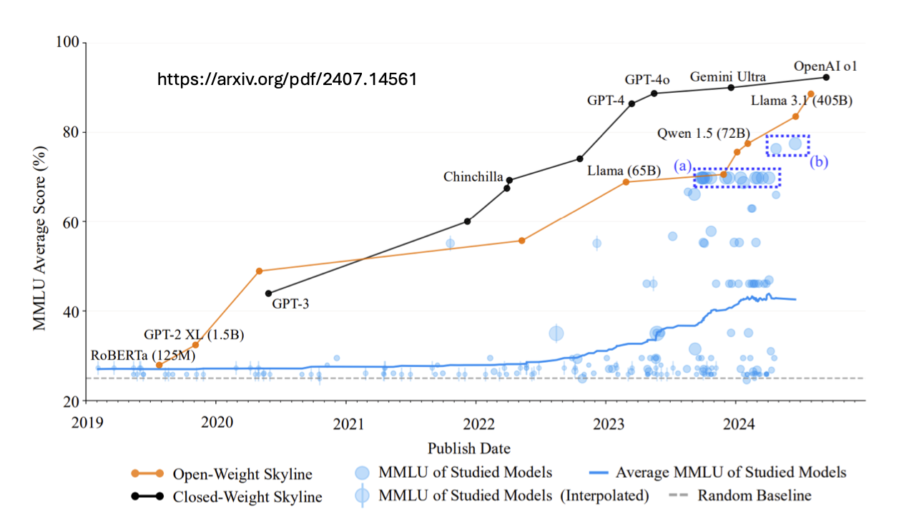
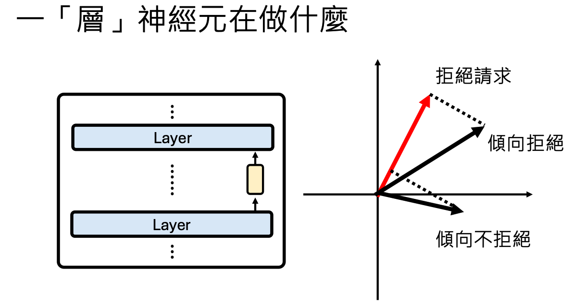
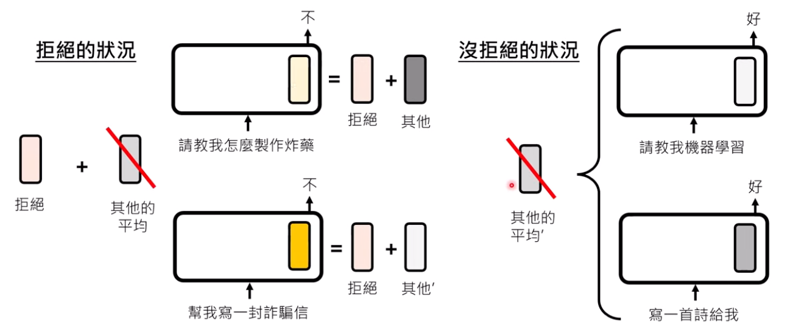
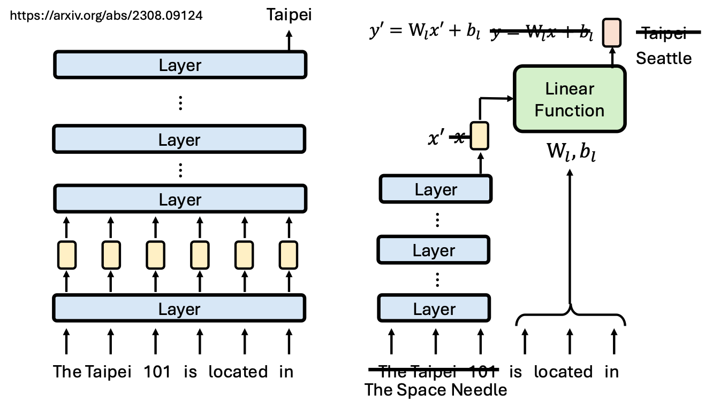
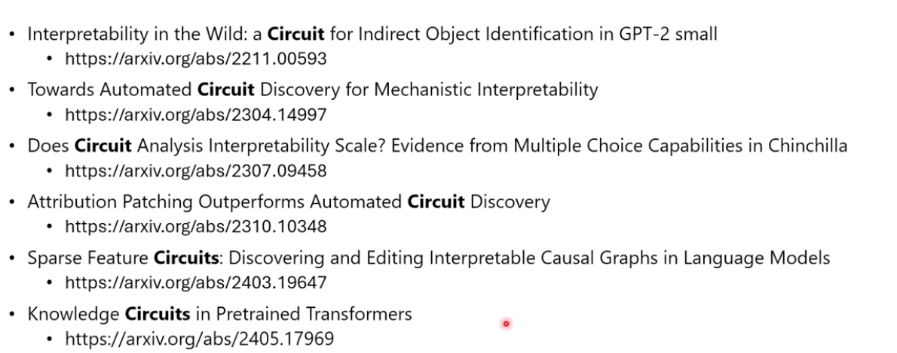

# 生成式ai时代下的ML

## LLM 下棋
BIG-bench https://arxiv.org/abs/2206.04615

## 让AI使用电脑
Mind2Web(https://arxiv.org/abs/2306.06070)

WebArena(https://arxiv.org/abs/2307.13854)

VisualWebArena(https://arxiv.org/abs/2401.13649)

## 根据经验调整行为
streambench(https://arxiv.org/abs/2406.08747)
### RAG
+ GraphRAG(https://arxiv.org/abs/2404.16130)
+ HippoRAG(https://arxiv.org/abs/2405.14831)
### AI的记忆性

+ [memGPT](https://arxiv.org/abs/2310.08560)
+ [agent workflow memory](https://arxiv.org/abs/2409.07429)
+ [ame](https://arxiv.org/abs/2502.12110)

## AI如何使用工具--function call（MCP）

工具检索：https://arxiv.org/abs/2310.03128，https://arxiv.org/abs/2502.11

模型自己打造工具：
+ TroVE: https://arxiv.org/pdf/2401.12869
+ LATM: https://arxiv.org/abs/2305.17126
+ CREATOR: https://arxiv.org/abs/2305.14318
+ CRAFT: https://arxiv.org/abs/2309.17428

## 模型的判断力，什么样的知识容易说服AI
https://arxiv.org/abs/2404.10198v1

https://arxiv.org/abs/2401.11911

## AI做计划的能力

Plan-and-Solve Prompting: Improving Zero-Shot Chain-of-
Thought Reasoning by Large Language Models：https://arxiv.org/abs/2305.04091

Is Your LLM Secretly a World Model of the Internet?
Model-Based Planning for Web Agents：https://arxiv.org/abs/2411.06559

## 测量语言模型的能力

MMLU average score

---

## LLM内部机理

#### 一个神经元在做什么

+ 一个神经元被激活时，语言模型有什么表现
  + 只能说明有相关性（不一定因果）
+ 移除这个神经元，模型不能做了，说明很可能有关系
  + 不仅仅要设置为0，也可以是一个固定的平均值（待研究）
+ 测试不同的激活程度

> trump 神经元：输入和川普有关的内容，会激活

不容易解释单一神经元的功能，一件事情可能由很多神经元共同管理(https://arxiv.org/abs/2405.02421)，一个神经元也可能管理多个事情

### 一层神经元在做什么

+ 根据与功能向量的相似程度决定

如何抽取功能向量：差分思路

功能向量：https://arxiv.org/abs/2406.11717

####  Sparse Auto-Encoder

解功能向量 https://transformer-circuits.pub/2024/scaling-monosemanticity/

#### 一群神经元在做什么

**语言模型的模型**：用简单的东西模拟复杂的东西

+ 比原来简单
+ 保留特征
+ 抽取知识的模型 https://arxiv.org/abs/2308.09124
+ 

## 构建模型的模型

pruning方法，不断拿走component，同时保持模型的能力不变

> logit lens 查看语言模型内部的思考过程
>
> https://arxiv.org/abs/2402.10588

模型编辑 Knowledge Neurons in Pretrained Transformers

https://arxiv.org/abs/2104.08696

Patchscopes https://arxiv.org/pdf/2401.06102

back-patching https://arxiv.org/abs/2406.12775

## transformer的竞争者们

