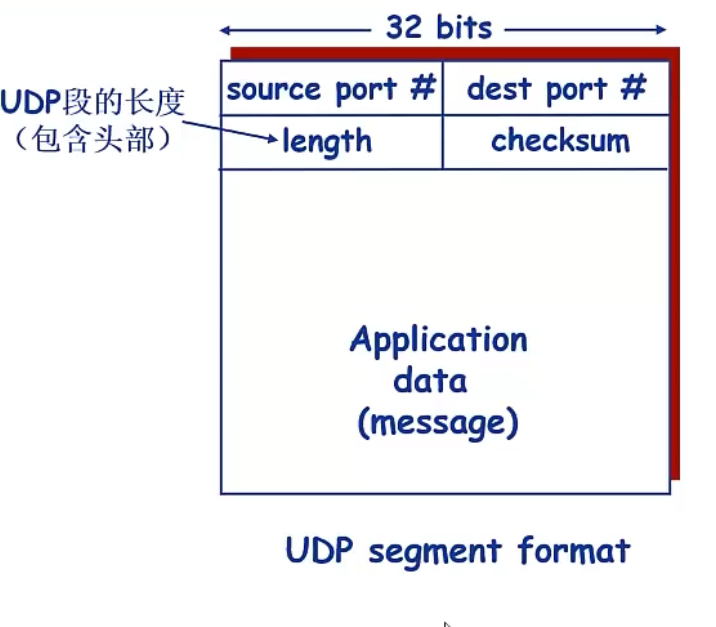
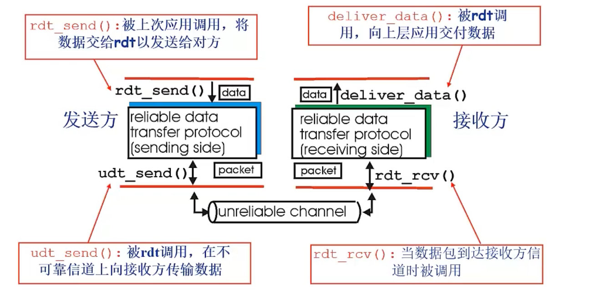
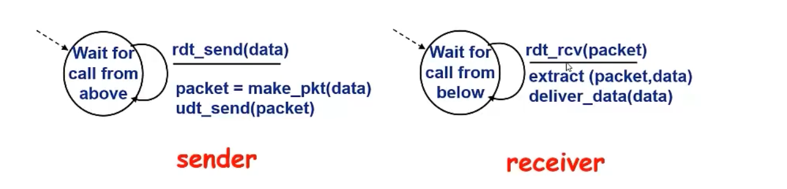

# 计算机网络之 探赜索隐

## 传输层

传输层协议为运行在不同的Host上的进程提供了一种**逻辑通信机制**（端到端通信）

+ 端系统运行传输层协议
  + 发送方：将应用递交的消息分成一个或多个segment，并向下传递给网络层
  + 接收方：将接收到的segment组装成消息，并向上交给应用层
+ 分类
  + tcp
    + 拥塞控制
    + 流量控制
    + 连接建立
  + udp
    + Best-effort
+ 网络层：提供主机之间的逻辑通信机制
+ 传输层：提供应用进程之间的逻辑通信机制
  + 位于网络层之上
  + 依赖于网络层服务
  + 对网络层服务进行（可能的）增强

### 多路复用与多路分用

为什么需要多路复用/分用？

+ 接收端进行多路分用
  + 传输层依据头部信息将收到的Segment交给正确的Socket，即不同的进程
+ 发送端进行多路复用
  + 从多个Socket接收数据，为每个数据块封装头部信息，生成Segment，交给网络层

#### 多路分用

+ 主机接收IP数据报
  + 每个数据报携带源IP，目的IP
  + 每个数据报携带一个Segment
  + 源端口，目的端口号
+ 收到segment后，提取IP和port，将Segment导入对应的Socket
  + TCP做更多处理
  + 网络层对端口号透明

+ UDP的多路分用
  + 利用端口号创建Socket
  + 用二元组标识（目的IP，目的端口号）

+ TCP的多路分用使用四元组标识
  + 源IP
  + 源端口号
  + 目的IP
  + 目的端口号 
  + 服务器可能同时支持多个TCP socket
  + 可以使用面向线程的TCP

### UDP协议

+ 基于Internet IP协议
  + 复用/分用
  + 增加简单的错误校验(端到端检测)
+ Best-effort服务
  + 可能丢失
  + 非按序到达
+ 无连接
  + 发送方与接收方不需要握手
  + 每个UDP段段处理相独立
+ UDP为什么存在？
  + 无需建立连接（减小延迟）
  + 实现简单
  + 头部开销小
  + 没有拥塞控制，应用可以更好的控制发送时间和速率
+ 常用于流媒体应用，DNS，SNMP
+ 在UDP上实现可靠数据传输
  + 在应用层实现可靠性，错误恢复机制

### 可靠数据传输原理（RDT）

+ 什么是可靠？

  + 不错，不乱，不丢

  
  + **key：应用接口的箭头为单向，而数据传输为双向箭头**

+ 利用FSM刻画传输协议

  

#### Rdt1.0

+ 底层信道完全可靠

  + 不发生错误
  + 不会丢弃分组

+ 发送方和接收方的FSM独立

+ 由于是可靠信道，不需要控制交换

  

