#  计算机网络之 探赜索隐

## 传输层

传输层协议为运行在不同的Host上的进程提供了一种**逻辑通信机制**（端到端通信）

+ 端系统运行传输层协议
  + 发送方：将应用递交的消息分成一个或多个segment，并向下传递给网络层
  + 接收方：将接收到的segment组装成消息，并向上交给应用层
+ 分类
  + tcp
    + 拥塞控制
    + 流量控制
    + 连接建立
  + udp
    + Best-effort
+ 网络层：提供主机之间的逻辑通信机制
+ 传输层：提供应用进程之间的逻辑通信机制
  + 位于网络层之上
  + 依赖于网络层服务
  + 对网络层服务进行（可能的）增强

### 多路复用与多路分用

为什么需要多路复用/分用？

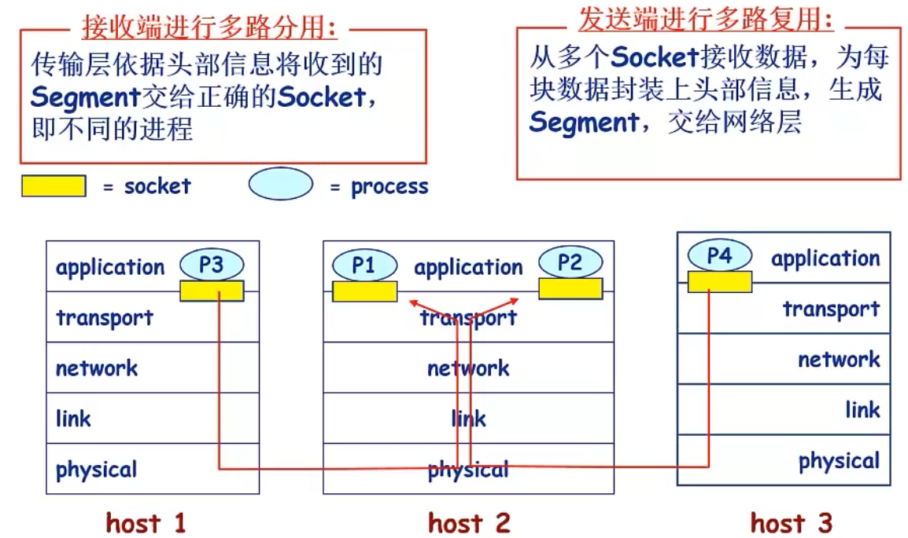

+ 接收端进行多路分用
  + 传输层依据头部信息将收到的Segment交给正确的Socket，即不同的进程
+ 发送端进行多路复用
  + 从多个Socket接收数据，为每个数据块封装头部信息，生成Segment，交给网络层

#### 多路分用

+ 主机接收IP数据报
  + 每个数据报携带源IP，目的IP
  + 每个数据报携带一个Segment
  + 源端口，目的端口号
+ 收到segment后，提取IP和port，将Segment导入对应的Socket
  + TCP做更多处理
  + 网络层对端口号透明

+ UDP的多路分用
  + 利用端口号创建Socket
  + 用二元组标识（目的IP，目的端口号）

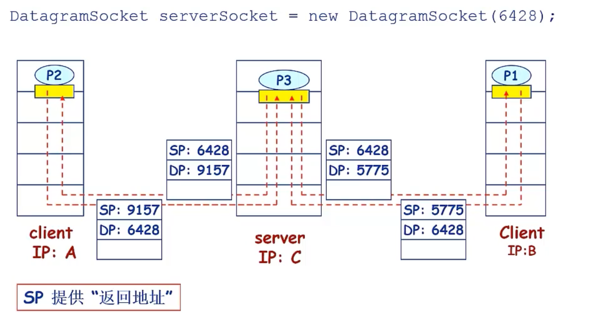

+ TCP的多路分用使用四元组标识
  + 源IP
  + 源端口号
  + 目的IP
  + 目的端口号 
  + 服务器可能同时支持多个TCP socket
  + 可以使用面向线程的TCP

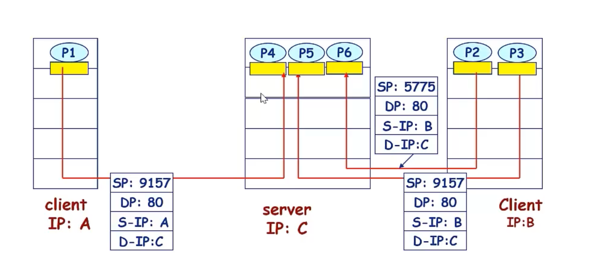

### UDP协议

+ 基于Internet IP协议
  + 复用/分用
  + 增加简单的错误校验(端到端检测)
+ Best-effort服务
  + 可能丢失
  + 非按序到达
+ 无连接
  + 发送方与接收方不需要握手
  + 每个UDP段段处理相独立
+ UDP为什么存在？
  + 无需建立连接（减小延迟）
  + 实现简单
  + 头部开销小
  + 没有拥塞控制，应用可以更好的控制发送时间和速率
+ 常用于流媒体应用，DNS，SNMP
+ 在UDP上实现可靠数据传输
  + 在应用层实现可靠性，错误恢复机制

### 可靠数据传输原理（RDT）

+ 什么是可靠？

  + 不错，不乱，不丢

  
  + **key：应用接口的箭头为单向，而数据传输为双向箭头**

+ 利用FSM刻画传输协议

  

#### Rdt1.0

+ 底层信道完全可靠

  + 不发生错误
  + 不会丢弃分组

+ 发送方和接收方的FSM独立

+ 由于是可靠信道，不需要控制交换

  

#### Rdt2.0

+ 只可能产生位错误的信道
  + 利用校验和来检测位错误
+ 分组不丢失，按序到达

+ 如何从错误恢复？
  + ACK机制：接收方显式告诉发送方分组被接受
  + NAK：分组有误
  + 发送方收到NAK后，重传分组
+ 基于重传机制的rdt协议称为ARQ协议（automatic repeat request)
+ 引入的新机制
  + 差错检测
  + ACK控制
  + 错误重传

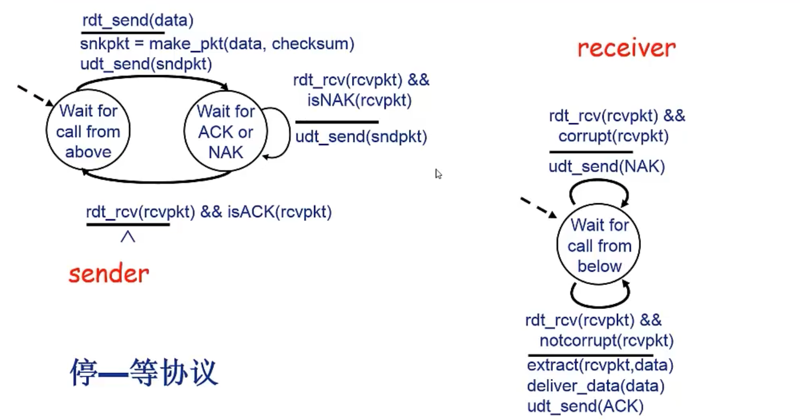

#### Rdt2.1

+ rdt2.0的缺陷
  + ACK/NAK发生错误无法处理
    + 增加校验和，检测错误并纠正（难度大）
    + 发送方收到被破坏的ACK/NAK时不知道发生了什么，添加额外控制消息（不能根本解决问题）
    + 发送方重传ACK，产生重复分组？
  + 如何解决？
    + **序列号（seq number）**
    + 接收方摒弃重复分组

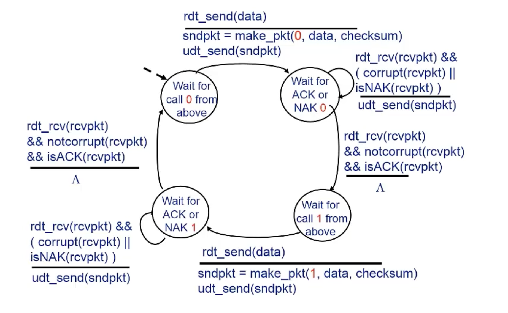

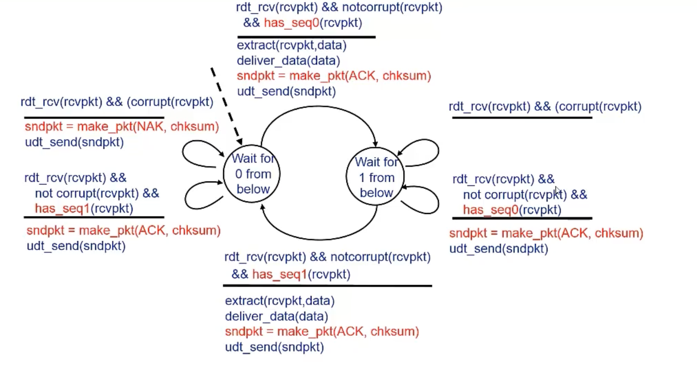

#### Rdt2.2:无NAK消息协议

- 与 **rdt 2.1** 功能相同，但是只使用 **ACK**

- 如何实现？
  - 接收方通过 **ACK** 告知最后一个被正确接收的分组
  - 在 **ACK** 消息中显式地加入被确认分组的序列号

- 发送方收到重复 **ACK** 之后，采取与收到 **NAK** 消息相同的动作
  - 重传当前分组

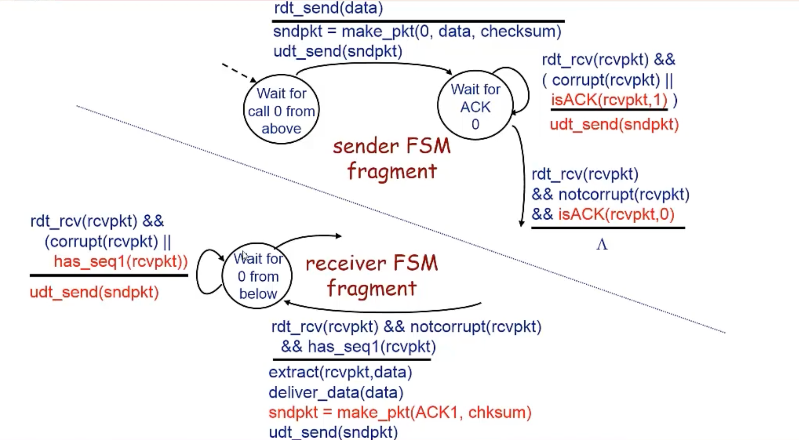

#### Rdt3.0

+ 如果信道既可能发生错误，也可能丢失分组，怎么办？
  + 发送方等待“合理”的时间
    + 如果没有ack，重传
    + 如果只是延迟，而不是丢失，可能会产生重复问题
      + 使用序列号
    + 接收方显示告诉接受的分组
    + 定时器

发送方：

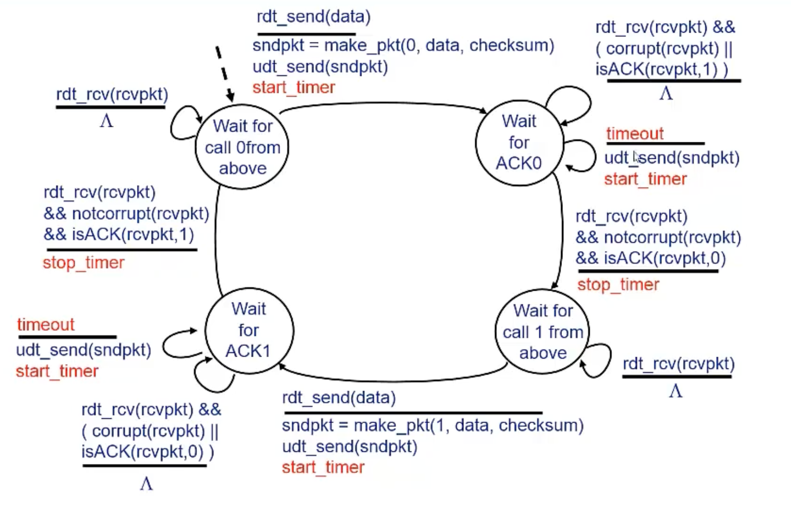

接收方：

典型场景：

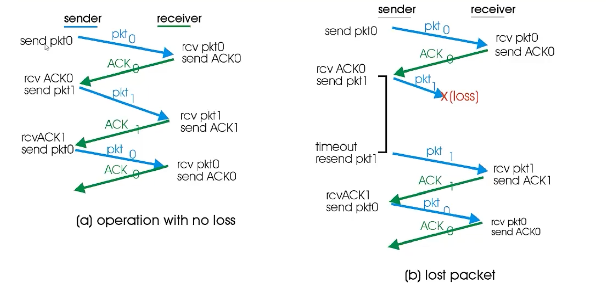

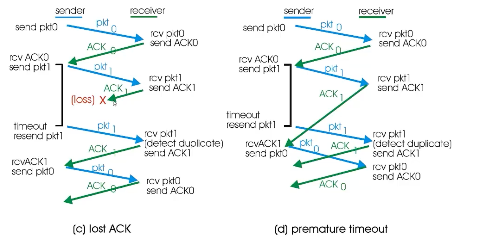

> 性能比较差：停等操作
>
> + 示例：1Gbps链路，15ms端到端传播延迟，1KB分组
>
> $$
> T_{\text{transmit}} = \frac{L \text{ (packet length in bits)}}{R \text{ (transmission rate, bps)}} = \frac{8\,\text{kb/pkt}}{10^9\,\text{b/sec}} = 8\,\mu\text{sec}
> $$
>
> - **发送方利用率**：发送方发送时间百分比
>
> $$
> U_{\text{sender}} = \frac{L / R}{\text{RTT} + L / R} = \frac{0.008}{30.008} = 0.00027
> $$
>
> - 在1Gbps链路上每30毫秒才发送一个分组 → **33KB/sec**
> - 网络协议限制了物理资源的利用

### 滑动窗口协议与流水线机制

流水线机制：提高资源利用率

+ 更大的序列号范围
+ 更大的缓存分组

滑动窗口协议: Sliding-window protocol

+ 窗口
  + 允许使用的序列号范围
  + 窗口尺寸为 **N**: 最多有 **N** 个等待确认的消息

+ 滑动窗口
  + 随着协议的运行，窗口在序列号空间内向前滑动

+ 滑动窗口协议: GBN, SR

#### GBN（go back N）

+ 分组头部k-bit序列号
+ 窗口尺寸N，最多N个分组未确认 

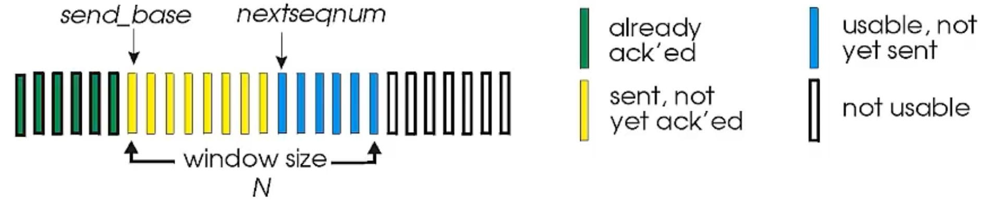

+ ACK(n):确认到序列号n的分组都被正确接收（包含n）
+ 为空中的分组设置timer
+ 超时：Timeout(n):重传序列号大于等于n，还未收到ACK的所有分组

发送方FSM：

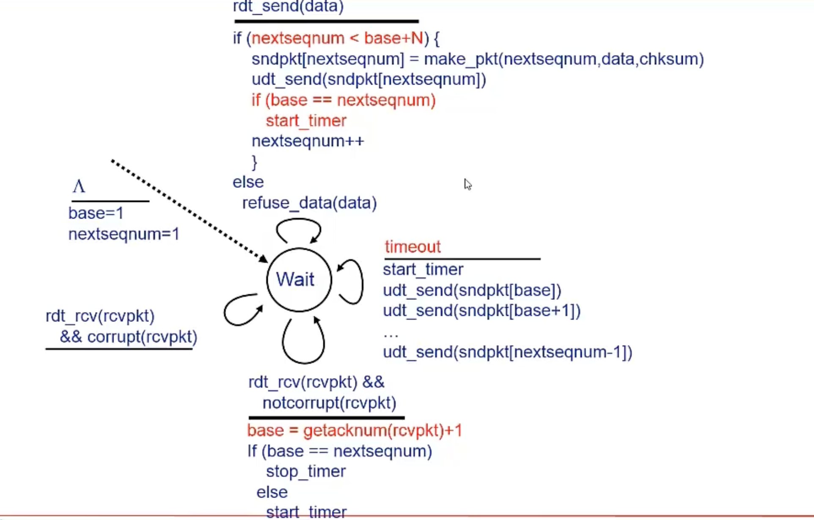

接收方：
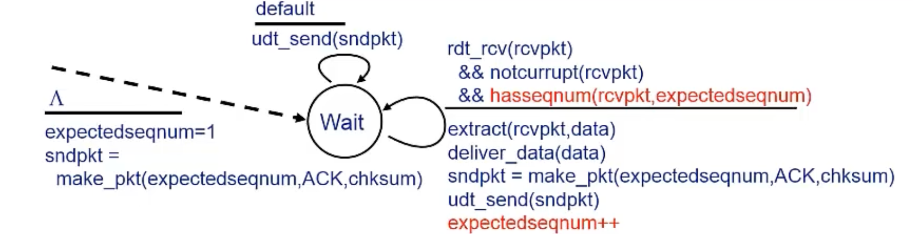

ACK机制: 发送拥有最高序列号的、已被正确接收的分组的ACK

- 可能产生重复ACK
- 只需要记住唯一的 `expectedseqnum`

乱序到达的分组:

- 直接丢弃 → 接收方没有缓存
- 重新确认序列号最大的、按序到达的分组

> - 数据链路层采用后退N帧（GBN）协议，发送方已经发送了编号为 $0 \sim 7$ 的帧。当计时器超时时，若发送方只收到 $0$、$2$、$3$ 号帧的确认，则发送方需要重发的帧数是多少？分别是那几个帧？
>
> - 解：根据 GBN 协议工作原理，GBN 协议的确认是累积确认，所以此时发送端需要重发的帧数是 **4** 个，依次分别是 **4、5、6、7** 号帧。

#### SR（selective Repeat）

+ GBN的缺陷
+ 接收方对每一个分组单独确认
  + 设置缓存机制，缓存每个一个乱序到达的分组
+ 发送方只重传没收到ack的分组
+ 发送方窗口
  + N个连续的序列号
  + 限制已发送且未确认的分组

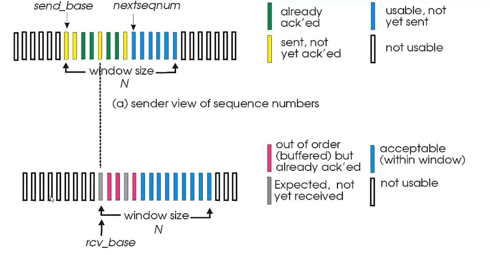

––sender—–

**data from above:**

- if next available seq # in window, send pkt

**timeout(n):**

- resend pkt n, restart timer

**ACK(n) in [sendbase, sendbase+N]:**

- mark pkt n as received
- if n smallest unACKed pkt, advance window base to next unACKed seq #

--- receiver ---
**pkt n in** $[rcvbase, rcvbase+N-1]$

- send ACK(n)
- out-of-order: buffer
- in-order: deliver (also deliver buffered, in-order pkts), advance window to next not-yet-received pkt

**pkt n in** $[rcvbase-N, rcvbase-1]$
- ACK(n)

**otherwise:**
- ignore

> 问题：序列号空间大小与窗口尺寸需要满  足：
>
> $N_S+N_R\le 2^k$

### TCP协议

+ 点对点
+ 可靠，按序字节流
+ 流水线机制
+ 发送/接收方缓存
+ 全双工
+ 面向连接
+ 流量控制机制

#### TCP段结构

 

+ 序列号:
  + 序列号指的是`segment`中第一个字节的编号，而不是`segment`的编号
  + 建立TCP连接时，双方随机选择序列号

+ ACKs:
  + 希望接收到的下一个字节的序列号
  + 累计确认：该序列号之前的所有字节均已被正确接收到

+ Q: 接收方如何处理乱序到达的Segment？
  + **A:** TCP规范中没有规定，由TCP的实现者做出决策

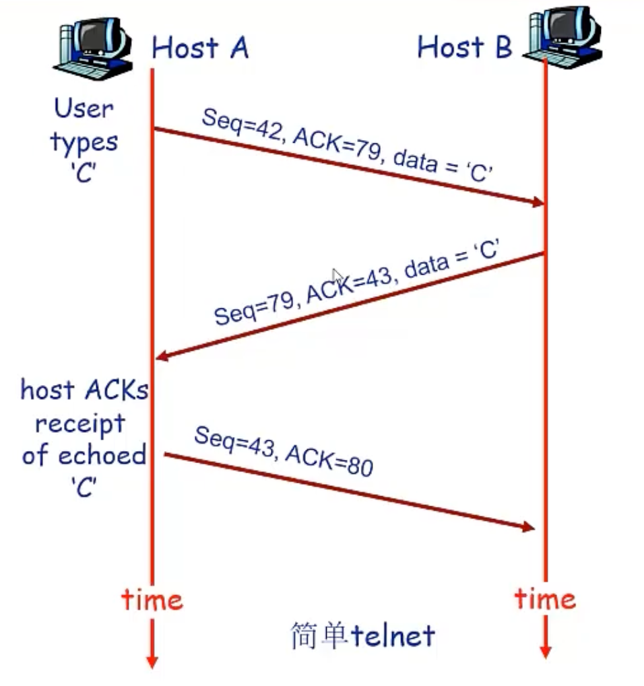

#### TCP可靠数据传输

- TCP在IP层提供的不可靠服务基础上实现可靠数据传输服务
- 流水线机制
- 累积确认
- TCP使用单一重传定时器

- 触发重传的事件
  - 超时
  - 收到重复ACK

- 渐进式
  - 暂不考虑重复ACK
  - 暂不考虑流量控制
  - 暂不考虑拥塞控制

> 如何设置TIMEOUT？
>
> + 大于RTT
>
>   + RTT在变化
>
> + 如何估计RTT？
>
>   + SampleRTT：测量从段发出去到收到ACK段时间
>
>   + 测量多个SampleRTT，求平均值行程RTT的估计值 
>
>     EstimatedRTT = (1- $\alpha$)*EstimatedRTT + $\alpha$*SampleRTT
>
>     指数加权移动平均 
>     典型值：0.125
>
>     ---
>
> 设置超时时间：
>
> 定时器超时时间的设置:
>
> - EstimatedRTT + “安全边界”
> - EstimatedRTT变化大 ➔ 较大的边界
>
> 测量RTT的变化值: SampleRTT与EstimatedRTT的差值
> $$
> \text{DevRTT} = (1 - \beta) * \text{DevRTT} + \beta * |\text{SampleRTT} - \text{EstimatedRTT}|
> $$
>
> (typically, $\beta = 0.25$)
>
> 定时器超时时间的设置:$$
> \text{TimeoutInterval} = \text{EstimatedRTT} + 4 \times \text{DevRTT}
> $$

#### 发送方事件

##### 从应用层收到数据

- 创建Segment
- 序列号是Segment第一个字节的编号
- 开启计时器
- 设置超时时间：TimeOutInterval

##### 超时

- 重传引起超时的Segment
- 重启定时器

##### 收到ACK

- 如果确认此前未确认的Segment
  - 更新SendBase
  - 如果窗口中还有未被确认的分组，重新启动定时器

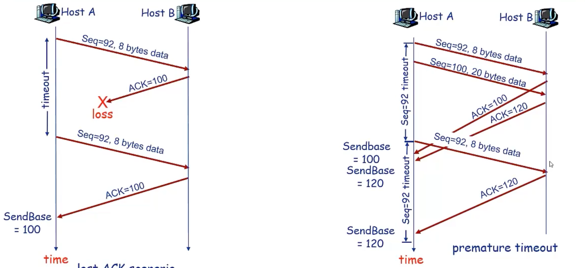

| Event at Receiver                                            | TCP Receiver action                                          |
| ------------------------------------------------------------ | ------------------------------------------------------------ |
| Arrival of in-order segment with expected seq \#. All data up to expected seq \# already ACKed | Delayed ACK. Wait up to 500ms for next segment. If no next segment, send ACK |
| Arrival of in-order segment with expected seq \#. One other segment has ACK pending | Immediately send single cumulative ACK, ACKing both in-order segments |
| Arrival of out-of-order segment higher-than-expect seq. \# . Gap detected | Immediately send **duplicate ACK**, indicating seq. \# of next expected byte |
| Arrival of segment that partially or completely fills gap    | Immediate send ACK, provided that segment starts at lower end of gap |

> 这张图片展示了 **TCP Receiver**（TCP 接收方）在不同事件发生时的 **ACK Generation Policy**（确认生成策略）。这是 TCP 协议中为了平衡“网络效率”与“快速错误恢复”而设计的一套规则（通常基于 RFC 1122 和 RFC 2581）。
>
> TCP 的确认机制既不像纯粹的 GBN，也不像纯粹的 SR，它是一种混合体。这张表具体解释了它是如何工作的。
>
> 以下是对表中四种情况的逐行详细解释：
>
> ------
>
> ### 1. 正常接收，且无待确认包 (Row 1)
>
> - Event (事件):
>
>   接收方收到了一个 In-order Segment（按序到达的报文段），序列号正是期望的（Expected Seq #）。并且，此前所有的数据都已经确认过了，没有任何 pending（挂起/未发送）的 ACK。
>
> - Action (动作):
>
>   Delayed ACK（延迟确认）。
>
>   接收方不立即发送 ACK，而是等待一段短暂的时间（通常是 500ms）。
>
> - **Why (原理解析):**
>
>   - **Piggybacking (捎带确认):** 如果接收方的应用层在 500ms 内有数据要回传给发送方，ACK 可以“搭便车”贴在这个数据包上一起发回去，节省带宽。
>   - **合并 ACK:** 如果在等待期间，下一个数据包到了（看下一条规则），就可以用一个 ACK 确认两个包，减少网络拥塞。
>
> ### 2. 正常接收，且有一个待确认包 (Row 2)
>
> - Event (事件):
>
>   接收方又收到了一个 In-order Segment，序列号也是期望的。但是，此时有一个 ACK Pending（即上一条规则中正在等待 500ms 倒计时的那个 ACK 还没发出去）。
>
> - Action (动作):
>
>   Immediately send single cumulative ACK（立即发送单个累积确认）。
>
>   这个 ACK 会确认刚刚收到的这两个数据包。
>
> - Why (原理解析):
>
>   TCP 标准建议每两个连续的数据包至少发送一个 ACK。既然已经积攒了两个未确认的包，就立刻确认。这防止了发送方的计时器超时，同时也清理了接收方的计时器状态。
>
> ### 3. 收到乱序包，检测到缺口 (Row 3)
>
> - Event (事件):
>
>   接收方收到了一个 Out-of-order Segment（乱序报文段），其序列号比期望的要大。这意味着中间出现了 Gap（缺口/丢包）。
>
> - Action (动作):
>
>   Immediately send Duplicate ACK（立即发送冗余确认）。
>
>   接收方再次发送上一次发送过的 ACK（指明它期望收到的那个缺失字节的序列号）。
>
> - Why (原理解析):
>
>   这是为了触发 Fast Retransmit（快速重传）机制。
>
>   - 接收方通过发送 Duplicate ACK 告诉发送方：“我收到了后面的包，但是中间的 $X$ 号包丢了，请重传 $X$”。
>   - 如果发送方连续收到 3 个针对同一序列号的 Duplicate ACK，它就不会等待超时（Timeout），而是立刻重传丢失的包。
>
> ### 4. 收到填补缺口的包 (Row 4)
>
> - Event (事件):
>
>   接收方收到了一个能够 Partially or Completely Fills Gap（部分或完全填补缺口）的报文段。这通常是发送方进行重传后的结果。
>
> - Action (动作):
>
>   Immediate send ACK（立即发送 ACK）。
>
>   一旦缺口被填补，接收方需要立刻告诉发送方：“好了，我现在收到这里了，请把窗口向前滑动”。
>
> - Why (原理解析):
>
>   这是为了让发送方尽快更新窗口（Slide Window），继续发送后续的新数据。
>
> ------
>
> ### 总结 (Summary)
>
> 这个表格体现了 TCP 在 **Reliability**（可靠性）和 **Efficiency**（效率）之间的权衡：
>
> 1. **在网络顺畅时（Row 1 & 2）：** TCP 尽量少发 ACK（Delayed ACK），采用 **Cumulative ACK** 机制来减少网络流量。
> 2. **在发生丢包时（Row 3）：** TCP 变得非常“急躁”，通过连续发送 **Duplicate ACK** 来催促发送方尽快重传，而不必死等超时。

#### 快速重传机制

+ 如果某个分组丢失，可能引发多个重复的ACK
+ 如果sender收到对同一个数据的3个ACK，则假定该数据之后的段已经丢失
  + 快速重传：在定时器超时之前进行重传 

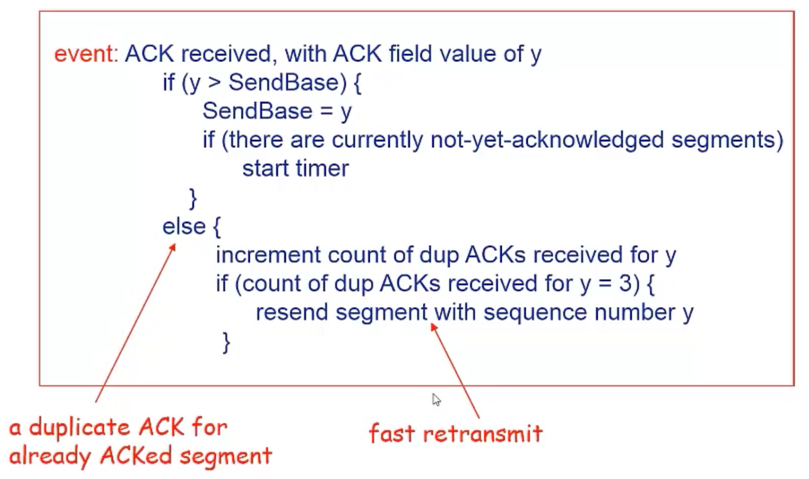

#### TCP流量控制

+ 如果上层应用处理数据较慢，则发送方不应该传输太快以至于让接收方buffer溢出
+ 速度匹配机制

Buffer中的可用空间(spare room)
$$
\text{RcvWindow} = \text{RcvBuffer} - [\text{LastByteRcvd} - \text{LastByteRead}]
$$

+ Receiver告诉Sender，RcvWindow = 0，出现什么情况

