# 计算机网络之 网尽其用

> 计算机网络是 互联的，自治的计算机集合
>
> + 自治–无主从关系
> + 互联互通 通信链路

## 通过交换网络互联主机

交换节点：路由器或交换机

## 什么是Internet

+ 全球最大的互联网络
  + ISP Internet Service Provider 
  + ISP 网络互连的网络之网络：移动网络，家庭网络，全球ISP，区域ISP，机构网络（如校园网）
+ 为网络应用提供通信服务的通信基础设施
+ 为网络应用提供应用编程接口

> 仅有硬件，网络能顺畅运行，有序交付数据吗？ 
>
> NO 还需要协议

## 网络协议

**数据交换必须遵从的规则**

协议规定了通信实体之间所交换的消息的格式，意义，顺序，以及针对收到信息或发生的事件所采取的动作

### 三要素

+ 语法 Syntax
+ 语义 Semantics
+ 时序 Timing

Internet协议标准

+ RFC：Request for Comments
+ IETF Internet Engineering Task Force 

## 计算机网络结构

网络边缘：

+ 主机（端系统）
  + 运行网络应用
  + 客户/服务器（client/server）应用模型
  + P2P模型（peer-peer)：不依赖专用服务器，实体之间直接进行通信

> 如何将网络边缘接入核心网络？
>
> + 住宅接入网络
> + 机构接入网络
> + 移动接入网络（无线）
>   + LANs 无线局域网
>   + 广域无线接入 手机流量
>
> 关心：
>
> + 带宽（数据传输速率）
> + 共享/独占

接入网络，物理介质：

+ 有线或无线通信链路

网路核心：

+ 互联的路由器（转发设备）
  + 关键功能：路由+转发
+ 网络之网络

> 核心问题：如何实现数据从源主机通过网络核心送达目的地的主机？
>
> A：数据交换

## Internet网络结构

+ 端系统通过接入ISP连接到Internet
+ ISP必须进一步互联

+ IXP：Internet exchange point 实现大型ISP之间互联

## 电路交换

不能点对点分别连接：使用交换设备，构建交换网络

> 什么是交换？
>
> + 动态转接
> + 动态分配传输资源

数据交换的类型：

+ 电路交换：电话网络
  + 建立电路连接
  + 通信
  + 释放连接
  + **资源独占型**

> 电路交换网络如何共享中继线？
>
> + 多路复用技术

+ 报文交换
+ 分组交换

## 多路复用技术（multiplexing)

+ 划分资源片
+ 每路独占分配到的资源片进行通信
+ 典型技术：
  + 频分度用FDM
  + 时分复用TDM：划分等长时间段（frame），用户使用固定序号的时隙
  + 波分复用
    + 光的频分复用
  + 码分复用 CDM
    + 广泛用于无线链路共享（蜂窝网，卫星通信）
    + 每个用户分配唯一的码片序列（+1，-1）
    + 每个用户使用相同频率载波，使用码片序列来编码
    + $编码信号=原始数据\times码片序列$
    + 各个用户码片序列正交

> - 令 $\{d_i\}$ 为原始数据序列，各用户的叠加向量为
>
> $$
> P = \sum_{i=1}^{N} d_i \cdot S_i = \sum_{i=1}^{N} S_i^{(-)}
> $$
>
> - **解码**: 码片序列与编码信号的内积
>
> $$
> \frac{1}{m} S_i \cdot P =
> \begin{cases}
> 1 & S_i \in P \\
> -1 & \overline{S}_i \in P \\
> 0 & S_i, \overline{S}_i \not\in P
> \end{cases}
> $$

## 报文交换与分组交换

### 报文交换

+ 电报

### 分组交换：统计多路复用

+ 需要报文的拆分和重组
+ 产生额外开销
+ 按需共享链路

> 那种更好呢？
>
> 传输延迟：
>
> + 分组交换
>   + 分组传输延迟$L/R$
>   + 传输更快，不用等待
>   + 需要的缓存小
> + 报文交换
>   + 传输延迟$M/R$
>   + 路由器需要很大缓存 

分组交换报文交付时间：
**- 报文: **M** bits
- 链路带宽（数据传输速率）: **R** bps
- 分组长度（大小）: **L** bits
- 跳步数: $ h $
- 路由器数: $ n $

$$
T = \frac{M}{R} + \frac{(h-1)L}{R}= \frac{M}{R} + \frac{nL}{R}
$$

> - **例：**
>   - **1 Mb/s链路**
>   - **每个用户：**
>     - “活动”时需 100 kb/s
>     - 平均活动时间 10%
>
> - **电路交换：**
>   - 10用户
>
> - **分组交换：**
>   - 对于 35个用户，大于 10 个用户同时活动的概率 < 0.0004
>
> 分组交换允许更多用户同时使用网络！ 适用于**突发数据传输网络**，可能产生拥塞 congestion

## 计算机网路的性能

`速率`：数据从传输速率，比特率，单位时间传输信息量

+ 单位 bps，kbps，Mbps，Gbps （1000的n次方）
+ 默认为额定速率，标称速率

`带宽`：与信号与系统的有区别，不代指频率，这里指数字信道所能传输的最大传输速率 bps

`延迟	`：

+ 节点处理延迟$d_{proc}$

  + 差错检测
  + 确定输出链路
  + 通常小于ms

+ 排队延迟$d_{queue}$

  + 等待输出链路可用

  + 取决于路由器拥塞程度

  + > - $ R $: 链路带宽 (bps)
    >
    > - $ L $: 分组长度 (bits)
    >
    > - $ a $: 平均分组到达速率
    >
    >   **流量强度**（traffic intensity）
    >
    > $$
    > \text{流量强度} = \frac{La}{R}
    > $$
    >
    > - $ La/R \sim 0 $: 平均排队延迟很小
    > - $ La/R \to 1 $: 平均排队延迟很大
    > - $ La/R > 1 $: 超出服务能力，平均排队延迟无限大！

+ 传输延迟$d_{trans}$

  + 分组长度
  + 链路带宽

+ 传播延迟$d_{prop}$

  + 链路长度
  + 传播速度 ($\approx 2\times10^8$ m/s)
  + $d_{porp}=d/s$

$$
d_{\text{nodal}} = d_{\text{proc}} + d_{\text{queue}} + d_{\text{trans}} + d_{\text{prop}}
$$

> 分组交换为什么产生丢包和时延？
>
> + 分组在路由器缓存中排队
>   + **分组到达速率超出输出链路容量时**
>   + 分组排队，等待输出链路可用

`时延带宽积`：时延带宽积 = 传播时延 × 带宽

+ 结果是数据量，相当于链路的容纳量

`分组丢失`（丢包）

+ 队列缓存容量有限
+ 分组到达已满队列将被丢弃
+ 丢弃分组可能有前序节点或源重发

$$
\text{丢包率} = \frac{\text{丢包数}}{\text{已发分组总数}}
$$

`吞吐量`：发送端到接收端之间的数据传输速率

+ 即时吞吐量
+ 平均吞吐量
+ internet场景
  + 每条“连接”的端到端吞吐量：$\min(R_C, R_S, R/N)$
  - 实际网络：$R_C$ 或 $R_S$ 通常是瓶颈

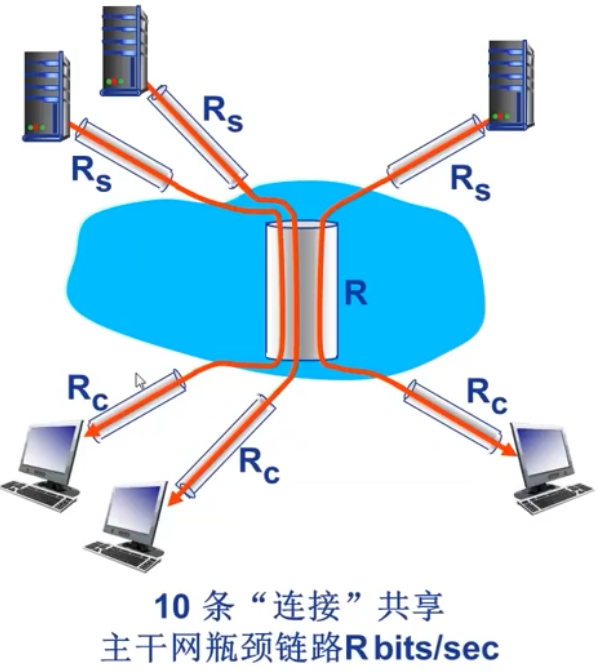

## 计算机网络体系结构

**分层结构**很好的描述了计算机网络的体系结构

基本概念

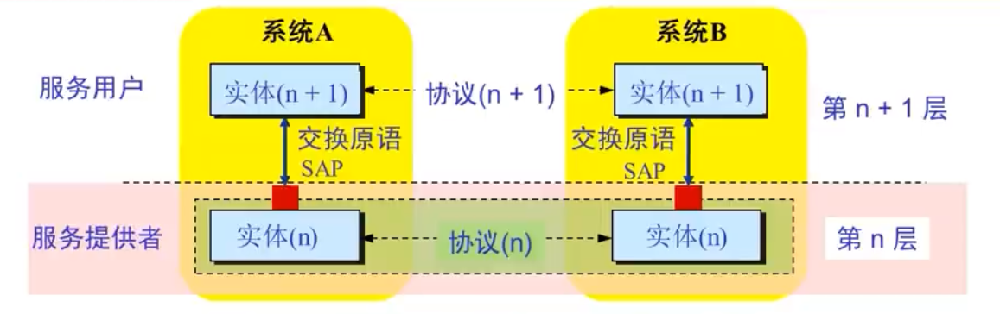

- **实体**(entity) 表示任何可发送或接收信息的硬件或软件进程。
- 协议是控制**两个对等实体**进行通信的规则的集合，协议是“**水平的**”。
- 任一层实体需要使用**下层服务**，遵循本层协议，实现本层功能，向**上层提供服务**，服务是“**垂直的**”。
- 下层协议的实现对上层的服务用户是**透明的**。
- 同系统的相邻层实体间通过**接口**进行交互，通过**服务访问点 SAP** (Service Access Point)，交换**原语**，指定请求的特定服务。

## OSI参考模型

目的是支持异构网络系统的互联互通

理论成功，市场失败。理解网络通信的最佳学习工具

1. 物理层
2. 数据链路层
3. 网络层
4. 传输层 后面是端到端层 end-to-end 
5. 会话层
6. 表示层
7. 应用层

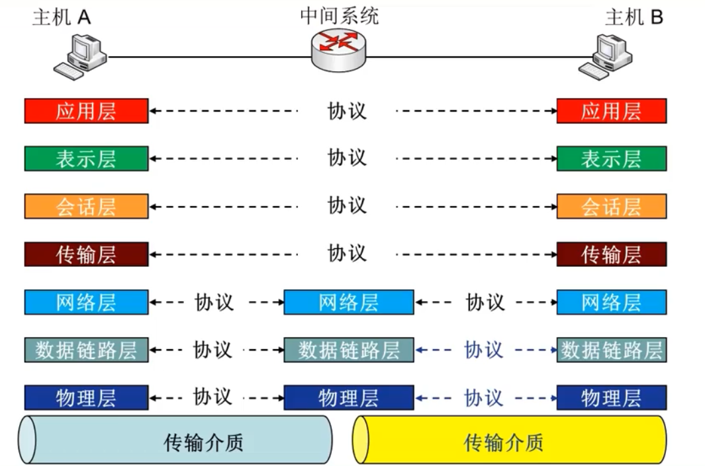

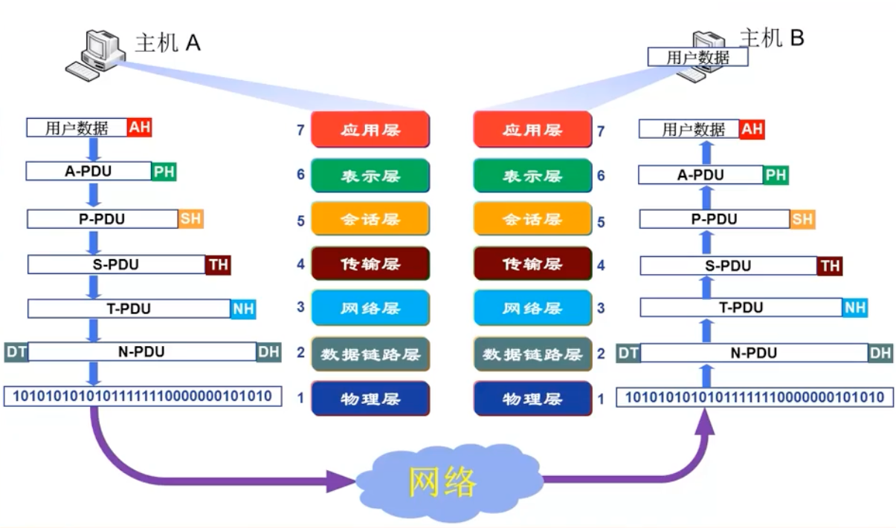

### 为什么需要数据封装

+ 增加控制信息
  + 构造协议数据单元 (PDU)

+ 控制信息主要包括:

  + **地址（Address）**: 标识发送端/接收端
  + **差错检测编码（Error-detecting code）**: 用于差错检测或纠正
  + **协议控制（Protocol control）**: 实现协议功能的附加信息，如: 优先级（priority）、服务质量（QoS）、和安全控制等

  

### 物理层功能

实现每个bit的传输

+ 接口特性
  + 机械特性，电气特性，功能特性，规程特性
+ 比特编码
+ 数据率（传输速率）
+ bit同步
  + 时钟同步
+ 传输模式
  + 单工（simplex）
  + 半双工（half-duplux）（对讲机）
  + 全双工（full-duplex）

### 数据链路层功能

+ **负责节点到节点的数据传输**

+ **组帧（framing）** 
+ **物理寻址（physical addressing）**
+ 流量控制（flow control）
+ 差错控制（Error control）
+ 访问控制
  + 在任意指定时刻决定那个设备拥有链路控制使用权

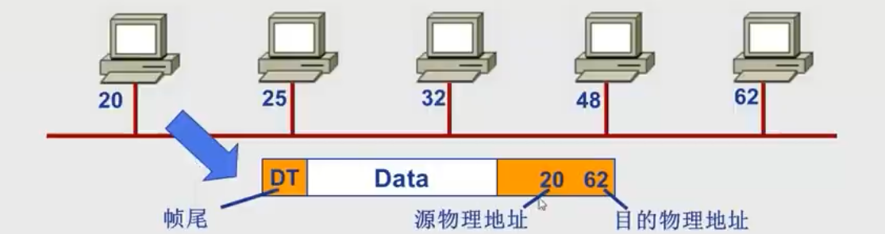

### 网络层功能

+ 负责源主机到目的主机数据分组的交付
  + 可能穿越多个网络
+ 逻辑寻址
  + 全局唯一的逻辑地址，如IP地址
+ 路由（routing）
+ 分组转发

### 传输层功能

+ 负责源-目的（端到端），进程间完整报文的传输
+ 分段与重组
+ SAP寻址
  + 确保将完整报文提交给正确进程（端口）
  + 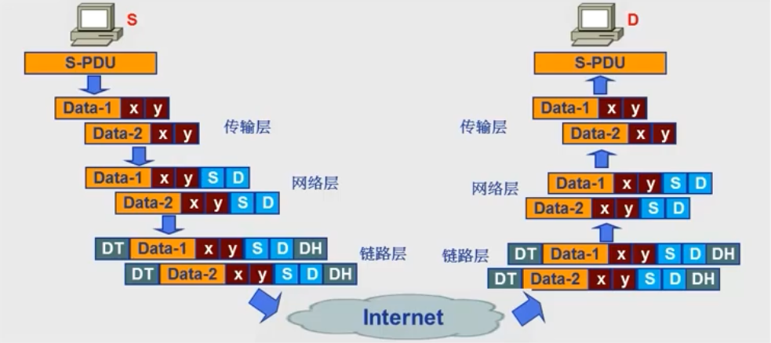
+ 连接控制（逻辑连接）
+ 流量控制
+ 差错控制

### 会话层功能

+ 对话控制（dialog controling）
+ 同步
  + 在数据流中插入同步点
+ 最薄的一层

### 表示层（集成到应用层）

+ 处理两个系统之间交换信息的语法与语义的问题
+ 数据表示转化
  + 大端序与小端序
+ 加密解密
+ 压缩解压缩

### 应用层

+ 支持用户通过用户代理或网络接口使用网络（服务）
+ 文件传输（FTP）
+ 电子邮件（SMTP）
+ Web（HTTP）

## TCP/IP 参考模型

>  **Everything over IP**

## 五层参考模型（应用最多）

综合了OSI和TCP/IP的优点

- **应用层**: 支持各种网络应用
  - FTP, SMTP, HTTP

- **传输层**: 进程-进程的数据传输
  - TCP, UDP

- **网络层**: 源主机到目的主机的数据分组路由与转发
  - IP协议、路由协议等

- **链路层**: 相邻网络元素（主机、交换机、路由器等）的数据传输
  - 以太网（Ethernet）、802.11 (WiFi)、PPP

- **物理层**: 比特传输

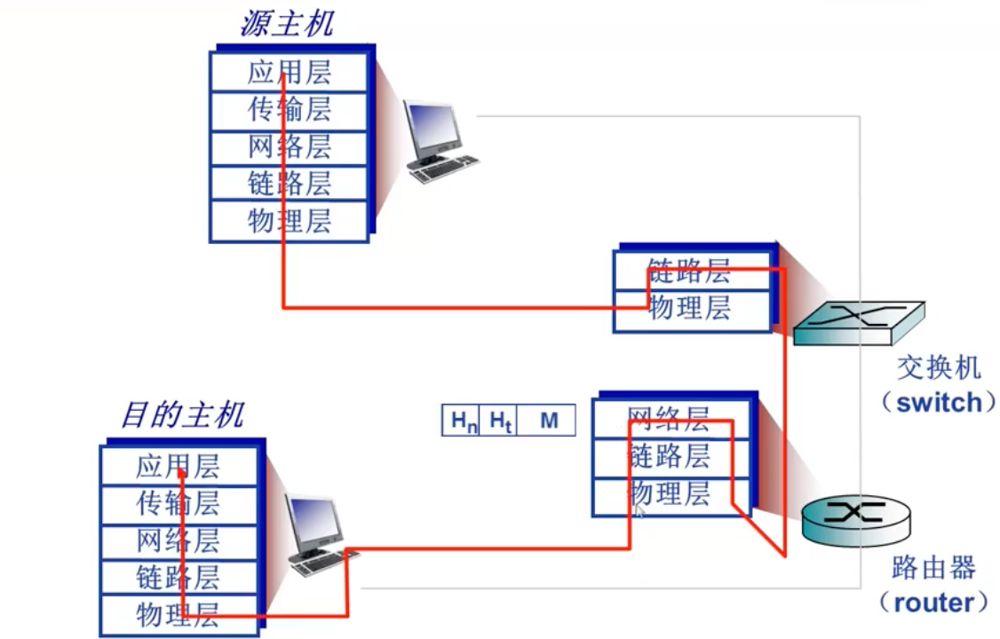

### 计算机网络与Internet发展历史

 

## 网络应用层

### 网络应用的体系结构

> 1. client/server
> 2. Peer-to-Peer
> 3. Hybrid

#### CS结构

+ 服务器
  + 24h提供服务
  + 永久性访问的地址/域名
  + 利用大量服务器实现可扩展性
+ 客户机
  + 与服务器通信，使用服务
  + 间歇性接入网络
  + 可能使用动态ip
  + 不与其他用户直接通信

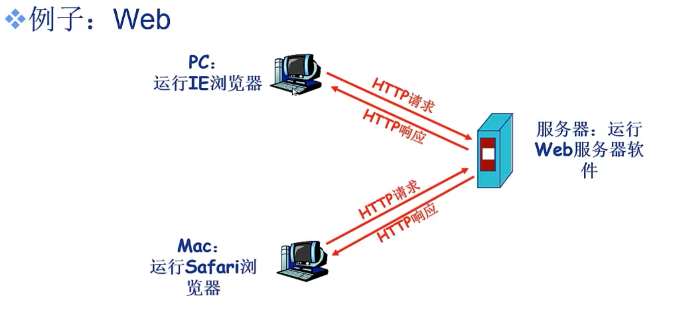

#### (纯)P2P结构

+ 没有永远在线的服务器
+ 任意节点之间可以直接通信
+ 可以间歇性接入网络
+ 节点可以改变ip
+ 优点：高度可伸缩
+ 缺点：难于管理

#### 混合结构

**Napster**

+ 文件传输使用P2P
+ 文件搜索使用CS结构
  + 向中央服务器提价查询请求，查找对应内容

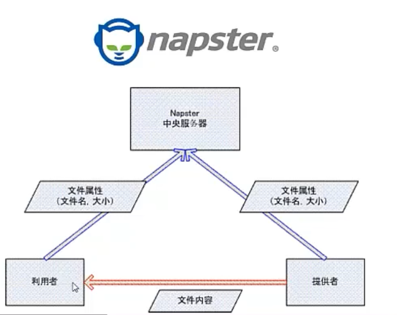

### 网络应用进程通信

**同一主机上运行的进程之间如何通信**？

- **进程间通信机制**
- **操作系统提供**

**不同主机上运行的进程间如何通信**？

- **消息交换**

> 在P2P架构的应用中也存在客户机进程，服务器进程之分

#### 套接字：SOCKET

+ 进程间通信利用socket发送/接收消息实现
+ 类似于寄信
+ 传输基础设置向进程提供api

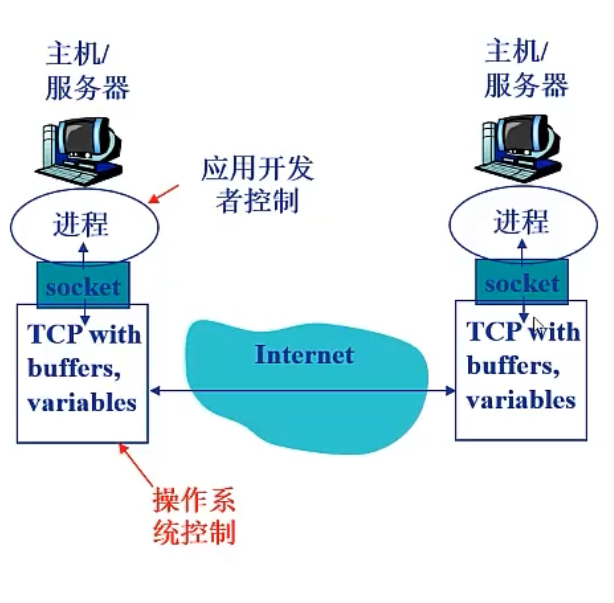

#### 如何寻址进程

+ 不同主机上进程通信，每个进程必须有标识符
+ 如何寻址主机
  + IP地址
+ 端口号
  + 为主机上每一个需要通信的进程分配一个端口号
+ Ip+port唯一表示进程

#### 应用层协议

+ 网络应用需遵循应用层协议
+ 公开协议
  + 由RFC（Request for comments）定义
  + 允许互操作
+ 私有协议
  + 多数P2P文件共享应用
+ 内容
  + 消息的类型
    + 请求
    + 响应
  + 消息的语法
    + 字段
    + 描述

### 网络应用需求与传输层服务

+ 数据丢失与可靠性
  + 能否容忍数据丢失
+ 时间延迟
  + 有些应用只有在延迟足够低时才有效
+ 带宽
  + 某些应用只有在带宽达到最低要求时才有效：网络视频
  + email可以不要求带宽
+ 安全要求

#### Internet提供的传输服务

+ TCP
  + 面向连接
  + 可靠传输
  + 流量控制
  + 拥塞控制
  + 不提供时间延迟保障
  + 不提供最小带宽保障
+ UDP
  + 无连接
  + 不可靠的数据传输
  + 不提供
    + 可靠性保障
    + 流量控制
    + 拥塞控制
    + 延迟保障
    + 带宽保障

| Application            | Application layer protocol             | Underlying transport protocol |
| ---------------------- | -------------------------------------- | ----------------------------- |
| e-mail                 | SMTP [RFC 2821]                        | TCP                           |
| remote terminal access | Telnet [RFC 854]                       | TCP                           |
| Web                    | HTTP [RFC 2616]                        | TCP                           |
| file transfer          | FTP [RFC 959]                          | TCP                           |
| streaming multimedia   | proprietary (e.g. RealNetworks)     | TCP or UDP                    |
| Internet telephony     | proprietary (e.g., Vonage, Dialpad) | typically UDP                 |

### WEB应用概述

#### World Wide Web: Tim Berners-Lee

- 网页
- 网页互相链接

#### 网页(Web Page)包含多个对象(objects)

- 对象：HTML文件、JPEG图片、视频文件、动态脚本等
- 基本HTML文件：包含对其他对象引用的链接

#### 对象的寻址(addressing)

- URL (Uniform Resource Locator)：统一资源定位器 RFC1738
- scheme://host:port/path

### HTTP概述

+ 超文本传输协议
  + HyperText Transfer Protocol
+ CS结构
  + Brower：
  + Web Server： Apache

+ 使用TCP传输服务
  + 服务器在**80端口**等待客户的请求
  - 浏览器发起到服务器的TCP连接(创建套接字Socket)
  - 服务器接受来自浏览器的TCP连接
  - 浏览器(HTTP客户端)与Web服务器(HTTP服务器)交换HTTP消息
  - 关闭TCP连接
+ 无状态（stateless）
  - 服务器不维护任何有关客户端过去所发请求的信息
  - 减小复杂性

### HTTP连接类型

+ 非持久性连接

  + 每个TCP连接最多允许传输一个对象

    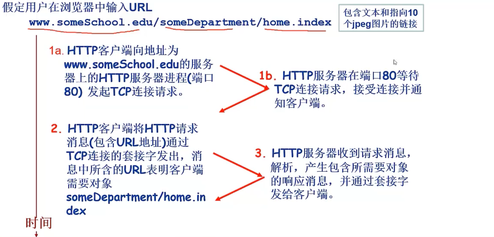

    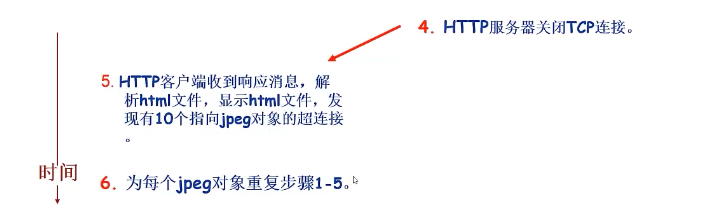
    $$
    Total = 2RTT + 文件发送时间
    $$
    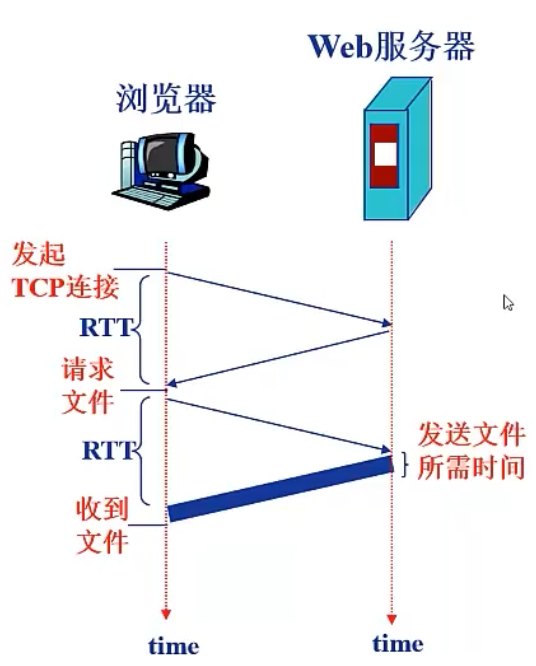

  + 时间慢

+ 持久性连接

  + 每个TCP连接允许传输多个对象
  + 无流水线的持久性连接
    + 客户端只有收到前一个响应之后才发送新请求
    + 每个被引用的对象耗时一个RTT
  + 有流水机制的持久连接
    + 客户端只要遇到一个引用对象就尽快发送请求
    + 理论上收到所有对象只用一个RTT

### HTTP消息格式

+ HTTP协议有两类消息

  + 请求消息（request）
  + 响应消息（response）

+ 请求消息

  + ASCII 人类可读

  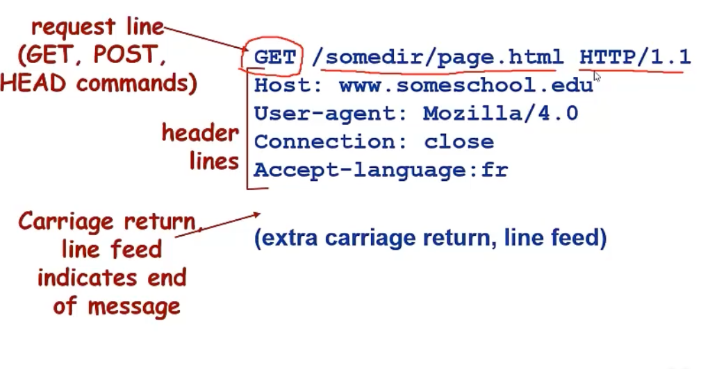

  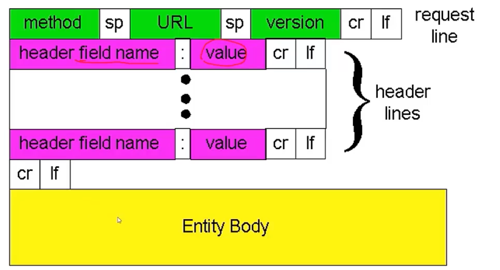

#### 上传输入方法

+ POST
  + 填写表格
+ URL方法
  + GET方法
  + 信息通过request行的URL字段上传

#### 方法的类型

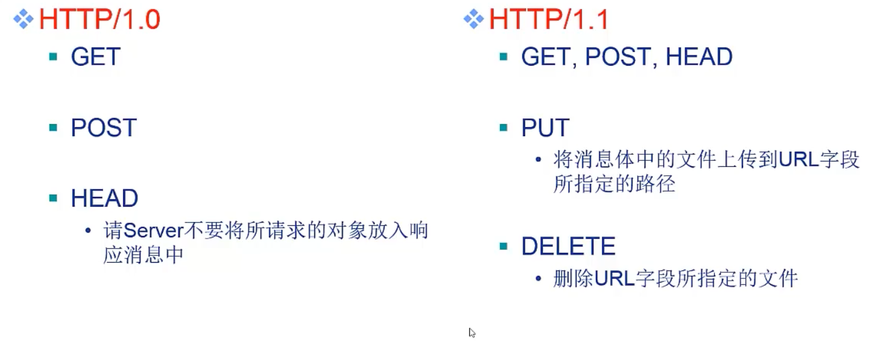

+ 响应消息

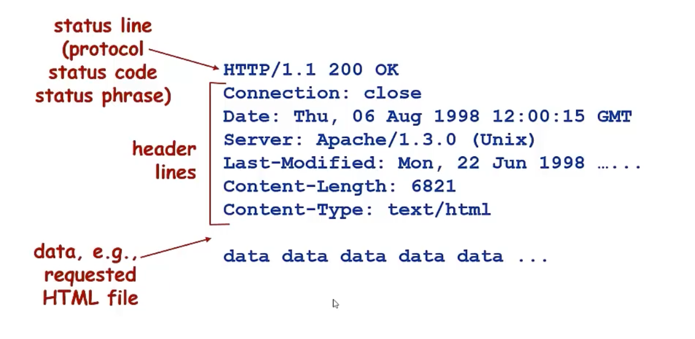

> date：生成响应时间
>
> Last-modified：上次修改时间

+ 响应状态代码
  + 200 OK
  + 301 Moved Permanently
  + 400 Bad Request
  + 404 Not Found
  + 505 HTTP Version Not Supported

### Cookie 技术

> 为什么需要cookie？
>
> HTTP无状态，但很多应用需要掌握客户端状态，如网上购物

+ Cookie技术
  + 某些网站为了辨别用户身份、进行**session**跟踪而储存在用户本地终端上的数据（通常经过加密）。
  + RFC6265

+ Cookie的组件
  + HTTP响应消息的cookie头部行
  - HTTP请求消息的cookie头部行
  - 保存在客户端主机上的cookie文件，由浏览器管理
  - Web服务器端的后台数据库

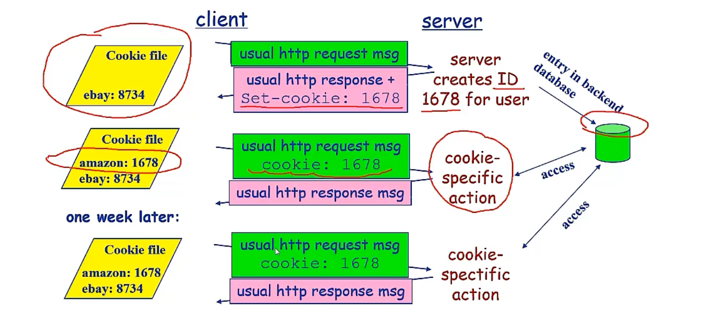

+ Cookie的作用

  + 身份认证
  + 购物车
  + 推荐
  + Web email

+ 隐私问题

+ > Cookie 能够怎样被用于收集隐私？能收集到哪些隐私？
  >
  > 1. 追踪 (Tracking)
  >
  >    最主要的用途是追踪您的在线行为。
  >
  > - **第一方 Cookie (First-party Cookies):** 由您正在访问的网站直接设置。它们主要用于记住您的偏好（如语言设置、登录状态、购物车内容），但也可以追踪您在该网站内的活动。
  > - **第三方 Cookie (Third-party Cookies):** 由您正在访问的网站以外的 **domains** 设置。这些通常来自广告商或社交媒体公司，它们通过在成千上万的网站上植入相同的 Cookie，来跨网站追踪您的浏览历史，建立您的 **profile**。
  >
  > 2. **Session** 管理
  >
  > 用于维护您的登录状态，虽然这本身是功能性的，但如果 Cookie 被盗（例如通过 **Cross-Site Scripting (XSS)** 攻击），攻击者就可以冒充您登录。
  >
  > 3. **Personalization** 和目标广告
  >
  > 收集关于您兴趣和行为的数据，以便向您展示相关的广告或个性化的内容。
  >
  > 好的，我将用简体中文回答，并在关键名词部分使用 **英文 (English)** 替换。
  >
  > Cookie 是一种在您浏览 **websites** 时，由服务器发送给您的 **web browser** 并存储在您设备上的小型文本文件。它们被广泛用于各种目的，但确实是收集用户 **privacy** 的一个重要工具。
  >
  > ##### 🕵️‍♀️ Cookie 可以收集到哪些 **Privacy** 信息？
  >
  > Cookie **本身** 并不直接包含您的真实姓名、地址等敏感信息，但它们包含的 **unique identifier (唯一标识符)** 允许将收集到的行为数据与您的设备和 **profile** 相关联。
  >
  > 以下是 Cookie 能够间接或直接收集到的主要信息类型：
  >
  > | 信息类别                                   | 描述                                                         |
  > | ------------------------------------------ | ------------------------------------------------------------ |
  > | **Browsing History** (浏览历史)            | 您访问了哪些网站、页面，以及在这些页面上停留了多长时间。     |
  > | **Preferences** (偏好设置)                 | 您的语言选择、显示设置、字体大小等。                         |
  > | **Login Status** (登录状态)                | 您是否已登录某个网站。                                       |
  > | **Geographic Location** (地理位置)         | 通常是基于您的 **IP address** 推断出的大致位置。             |
  > | **Device Information** (设备信息)          | 您的 **browser** 类型和版本、操作系统、屏幕分辨率。          |
  > | **Shopping Cart Contents** (购物车内容)    | 您在电子商务网站中添加但尚未购买的商品。                     |
  > | **Click/Interaction Data** (点击/互动数据) | 您点击了哪些链接、填写了哪些表单、进行了哪些操作。           |
  > | **Unique User ID** (唯一用户 ID)           | 用于识别您的浏览器并将其活动链接到您的 **profile** 的随机字符串。 |
  >
  > ##### 🛡️ 如何保护您的 **Privacy**？
  >
  > 为了限制 Cookie 收集您的隐私，您可以采取以下措施：
  >
  > 1. **定期清理 Cookie (Clear Cookies):** 定期清除浏览器中的 Cookie。
  > 2. **使用隐身模式 (Incognito/Private Mode):** 在此模式下，大多数 Cookie 在窗口关闭后会被删除。
  > 3. **阻止第三方 Cookie (Block Third-party Cookies):** 大多数现代浏览器都允许您在设置中阻止第三方 Cookie。
  > 4. **使用浏览器扩展 (Browser Extensions):** 如 **ad blockers** 或 **privacy extensions**，它们可以阻止追踪脚本和 Cookie。
  > 5. **VPN 或 Tor (Virtual Private Network):** 使用这些工具可以隐藏您的 **IP address**。

### WEB缓存/代理服务器技术

+ 在不访问服务器的前提下满足客户端的HTTP技术
+ 缩短客户请求响应时间
+ 减少机构/组织流量
+ 在大范围内实现有效的内容分发

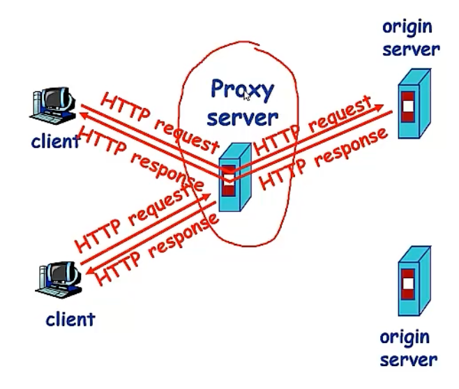

+ 用户设定浏览器通过缓存进行Web访问
+ 浏览器向缓存/代理服务器发送所有的HTTP请求
  + 如果请求对象在缓存中，直接返回对象
  + 否则，宰相原始服务器发送HTTP请求，在返回给客户端
+ 一般由ISP架设

> 如何保证缓存的内容是最新的？
>
> + 条件性GET方法：如果缓存有最新的版本，则不需要发送请求对象
> + 在HTTP请求中声明所持有版本的日期
>   + If-modified-since:<data>
> + 如果缓存的版本是最新的，则响应的消息中不包含对象
>   + HTTP/1.0 304 Not Modified

### Email的应用

+ 构成
  + 邮件客户端
  + 邮件服务器
  + SMTP协议（Simple Mail Transfer Protocol）
+ 邮件客户端
+ 邮件服务器
  + 邮箱：存储发给该用户的Email
  + 消息队列：存储等待发送的Email
+ SMTP协议
  + 邮件服务器之间传递消息的协议
  + 客户端：发送消息的服务器
  + 服务器：接收消息的服务器

#### SMTP协议

+ 使用TCP进行可靠传输
+ 端口25
+ 传输过程
  + 握手	
  + 消息传输
  + 关闭
+ 命令/响应交互模式
  + 命令 ASCII文本
  + 响应 状态代码和语句
+ 使用持久性连接
+ 要求消息必须由7位ASCII码构成
+ SMTP服务器利用CRLF.CRLF确定消息的结束

#### MIME：多媒体邮件扩展 RFC2045，2056

+ 通过在邮件头部添加额外的行以声明MIME的内容类型

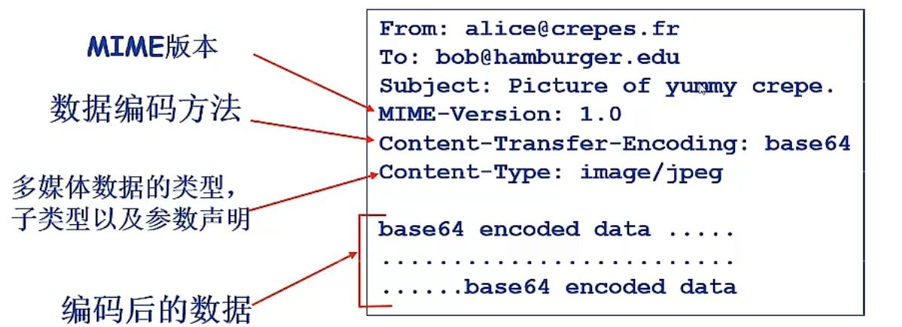

#### 邮件访问协议

+ 用户从服务器获取邮件

  + POP：Post Office Protocol RFC1939

    + 认证/授权和下载

    + > + 认证过程
      >   + 客户端命令
      >     + User：声明用户名
      >     + Pass：声明密码
      >   + 服务器响应
      >     + +OK
      >     + -ERR
      > + 事务阶段
      >   + List：列出消息数量
      >   + Retr：用编号获取消息
      >   + Dele：删除消息
      >   + Quit
      > + “下载并删除模式”：用户更换客户端后无法重读邮件
      > + “下载并保持模式”：不同客户端都可以保留消息的拷贝 
      > + POP3是无状态的

  + IMAP：Internet Mail Access Protocol RFC 1730

    + 更多功能，更加复杂，能够操纵服务器上存储的信息
    + 所有消息保存在服务器
    + 允许用户利用文件夹组织消息
    + 支持跨会话的用户状态

  +  HTTP：163，QQMail等    

### DNS服务

+ DNS：Domain Name System
+ 解决互联网上主机/路由器的识别问题
  + 将IP映射为域名

+ #### 域名解析系统DNS

  + 多层命名服务器构成的**分布式数据库**
  + **应用层协议**：完成名字的解析
    - Internet核心功能，用应用层协议实现
    - 网络边界复杂

+ DNS服务
  + 主机别名
  + 邮件服务器别名
  + 负载均衡

> 为什么不使用集中式的DNS：
>
> + 单点失败问题
> + 流量问题
> + 距离问题
> + 维护性问题

+ 分布式层次式数据库

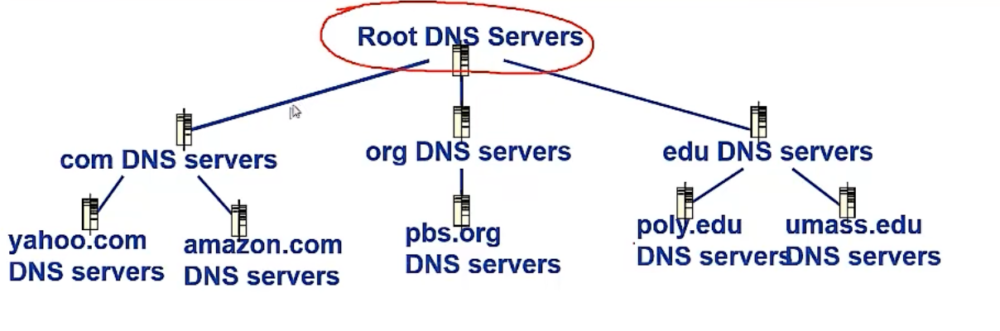

+ 客户端想要查询 `www.amazon.com` 的 IP
  + 客户端查询根服务器，找到 `com` 域名解析服务器
  + 客户端查询 `com` 域名解析服务器，找到 `amazon.com` 域名解析服务器
  + 客户端查询 `amazon.com` 域名解析服务器，获得 `www.amazon.com` 的 IP 地址

+ DNS根域名服务器
  + 本地域名解析服务器无法解析域名时，访问根域名服务器
  + 根域名服务器
    + 如果不知道映射，访问权威域名服务器
    + 获得映射
    + 向本地域名服务器返回映射

+ 顶级域名服务器：负责com，org，net，edu等
+ 权威域名服务器：组织的域名解析服务器，提供组织内部服务器的解析服务
  + 组织负责维护
  + 服务商提供商务负责
+ 本地域名解析服务器
  + 每个ISP都有一个
  + 当主机进行DNS查询时，查询被发送到本地域名服务器
  + 作为代理，将查询发送给层级式域名解析服务器系统

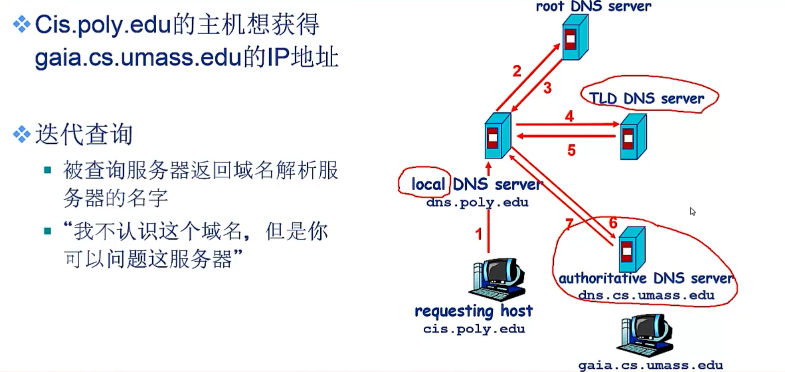

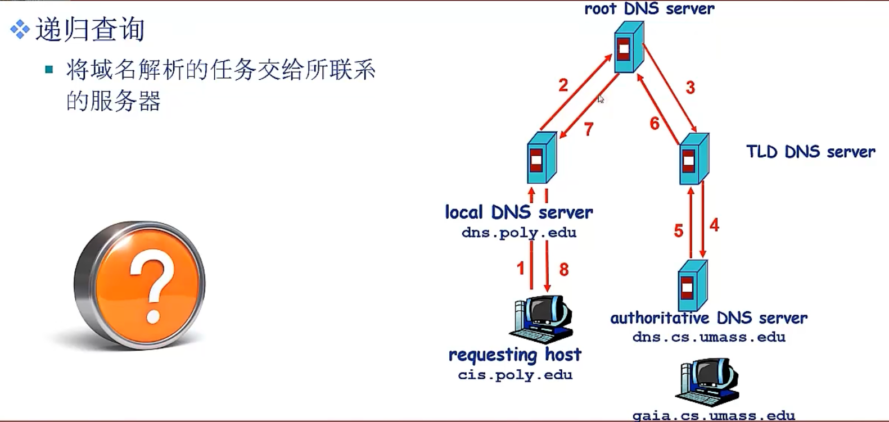

+ DNS记录缓存与更新
  + 缓存映射，一段时间后，缓存条目删除
  + 本地域名一般会缓存顶级域名服务器的映射
    + 因此根域名服务器不经常被访问

### DNS记录

+ 资源记录
  + RR format(name, value, type, ttl)
  + type=A
    + Name 主机域名
    + Value IP
  + type=NS
    + Name 域（edu.cn)
    + Value 该域权威域名解析服务器的主机域名
  + type=CNAME
    + Name 某一个真实域名的别名
    + 真实域名
  + type=MX
    + Value是与name对应的邮件服务器
+ DNS协议与消息
  + query and reply
  + 消息格式相同
  + 

